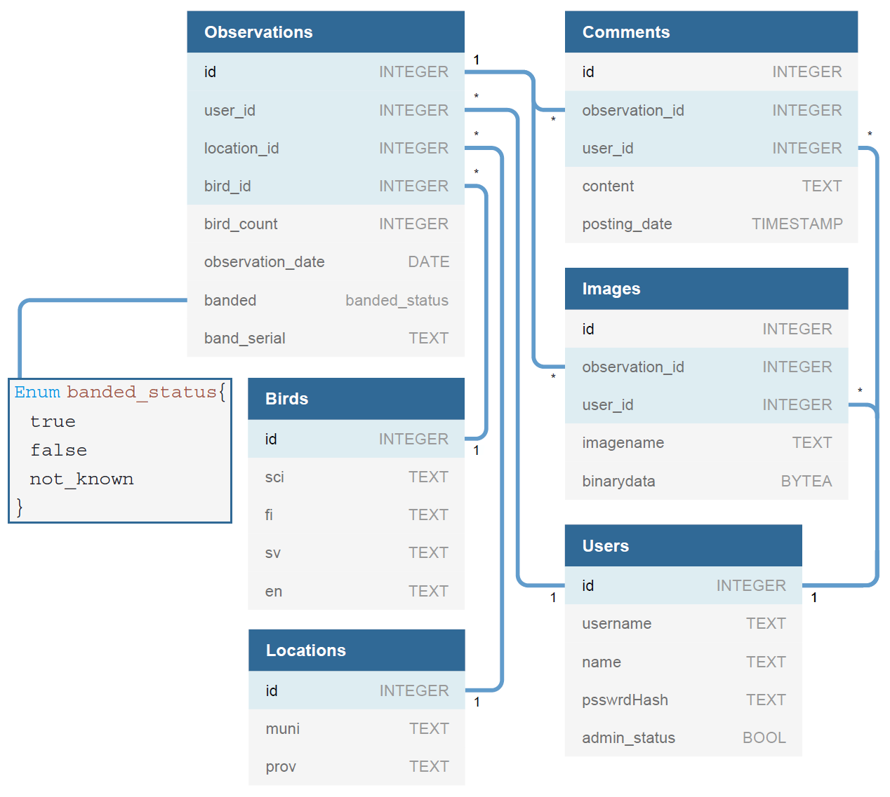

# Lintubongarin lokisovellus

## Sovelluksen tarkoitus

Sovellus tarjoaa alustan lintuhavaintojen kirjaamiseen sekä aiempien havaintojen tarkasteluun ja kommentointiin.

## Käyttäjät

Sovelluksella on kaksi käyttäjäroolia, jotka ovat ns. _normaali käyttäjä_ ja _ylläpitäjä_.

## Keskeiset toiminnot

- Sovellukseen voi rekisteröidä käyttäjän sekä kirjautua sisään ja ulos
- Havaintoja voi hakea ja tarkastella kirjautumatta sisään
  - Hakutoiminnossa voi rajata havainnot lajin, sijainnin ja/tai ajan mukaan

### Normaali käyttäjä

- Uusien havaintojen luominen
  - Lintu
  - Sijainti
  - pvm
  - lkm
  - Rengastettu (kyllä/ei/ei tietoa)
  - Renkaan kirjainkoodi ja numerosarja
- Omien havaintojen muokkaaminen ja poistaminen
- Kuvan/kuvien lisääminen oman havainnon yhteyteen
- Minkä tahansa havainnon kommentointi

### Ylläpitäjä

- Pystyy poistamaan kommentteja, havaintoja sekä käyttäjättunnuksia.

## Alustava tietokantakaavio

Käyttöön otettaessa tietokanta tulee sisältämään Suomen linnut, kunnat ja maakunnat.

## Lisäominaisuudet ajan salliessa

- Käyttäjät pystyvät ehdottamaan uusia lajeja ja sijaintejä, jotka ylläpitäjä tarkastaa ja hyväksyy tai hylkää
- Havaintoihin voi lisätä tarvittaessa rengastetun linnun renkaan numeron
- Yksittäisen linnun havaintoja voi hakea rengasnumeron perusteella
- Muita lisätietokenttiä havaintoihin
